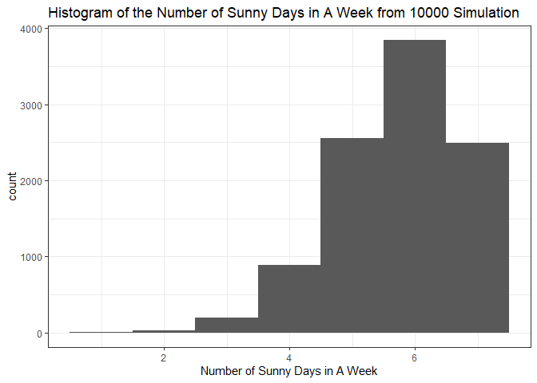

Simulation_Weather
================

``` r
knitr::opts_chunk$set(echo = TRUE)
```

## Scenario

Let city A be known to have 300 days of sunshine.

Using this information, let’s simulate the probability that a given week
has all sunny days.

``` r
# number of sunny days in a year, according to the claim
sunny_days <- 300
# Use the number of sunny days to represent the probability
# that a given day would be sunny
p <- sunny_days/365

# Simulate the scenario
reps <- 10000
sunny_in_a_week <- rbinom(reps, 7, p)
```

The probability that a given week has all sunny days is 0.2492.

``` r
library(tibble)
library(ggplot2)
library(dplyr)
```

    ## 
    ## Attaching package: 'dplyr'

    ## The following objects are masked from 'package:stats':
    ## 
    ##     filter, lag

    ## The following objects are masked from 'package:base':
    ## 
    ##     intersect, setdiff, setequal, union

``` r
tibble(x = sunny_in_a_week) %>% ggplot(aes(x = x)) +
      geom_histogram(binwidth = 1) + 
      # xlim(c(0,8)) + 
      xlab("Number of Sunny Days in A Week") +
      ggtitle("Histogram of the Number of Sunny Days in A Week from 10000 Simulation") + theme_bw()
```

<!-- -->

The probability that the next three days are not sunny:

``` r
set.seed(1234)
three_days_sunny <- rbinom(reps, 3, p)
set.seed(1234)
three_days_not_sunny <- rbinom(reps, 3, 1-p)

# show that these two approaches yield the same result
table(three_days_sunny)
```

    ## three_days_sunny
    ##    0    1    2    3 
    ##   47  800 3588 5565

``` r
table(three_days_not_sunny)
```

    ## three_days_not_sunny
    ##    0    1    2    3 
    ## 5565 3588  800   47

``` r
mean(three_days_sunny == 0)
```

    ## [1] 0.0047

``` r
mean(three_days_not_sunny == 3)
```

    ## [1] 0.0047

# Assumptions Discussion

We are assuming that the days are independent, and that each day has the
same probability of being sunny, regardless of the season and time of
year. These assumptions are not necessarily realistic.
